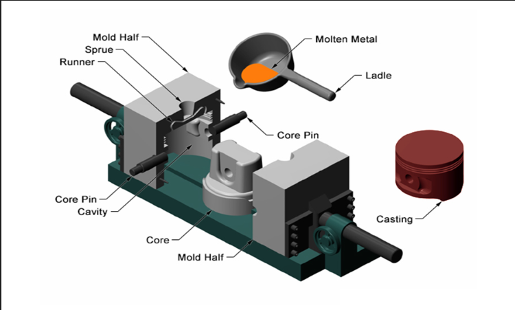
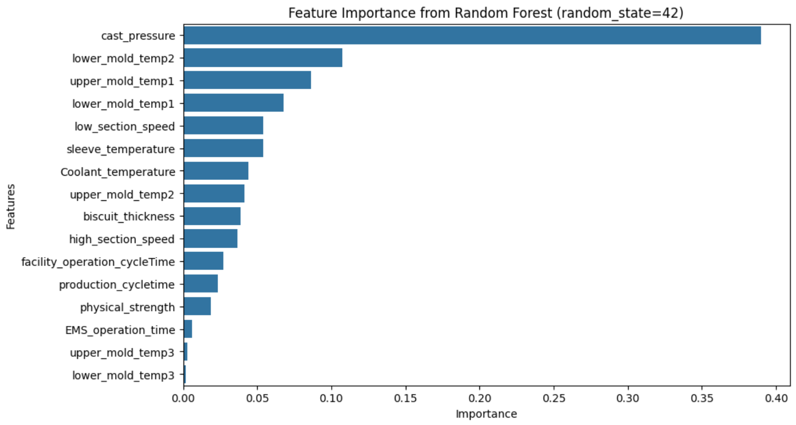
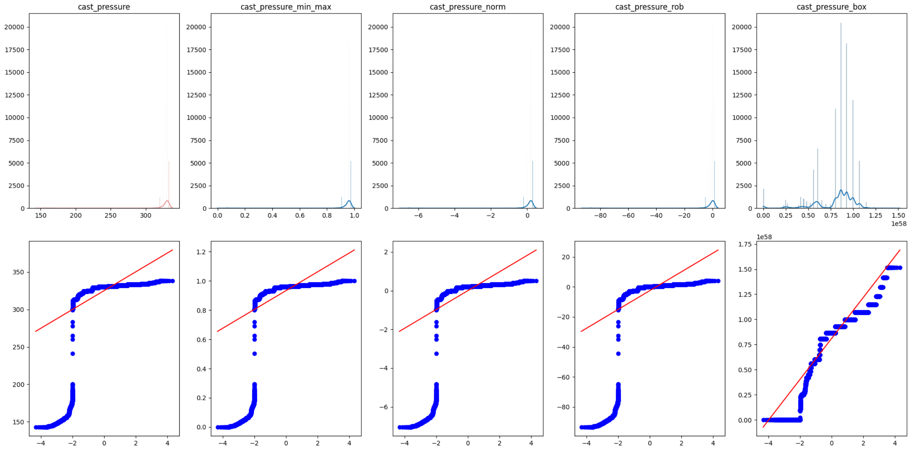
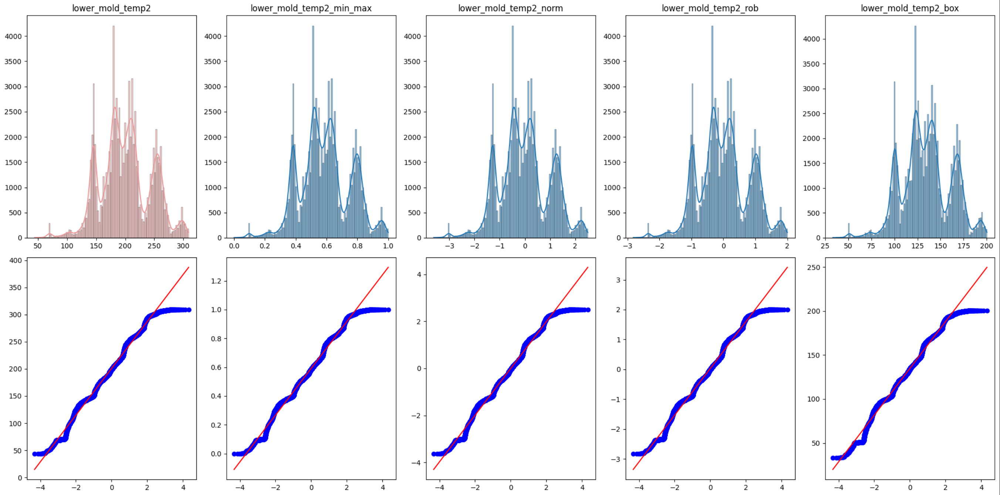
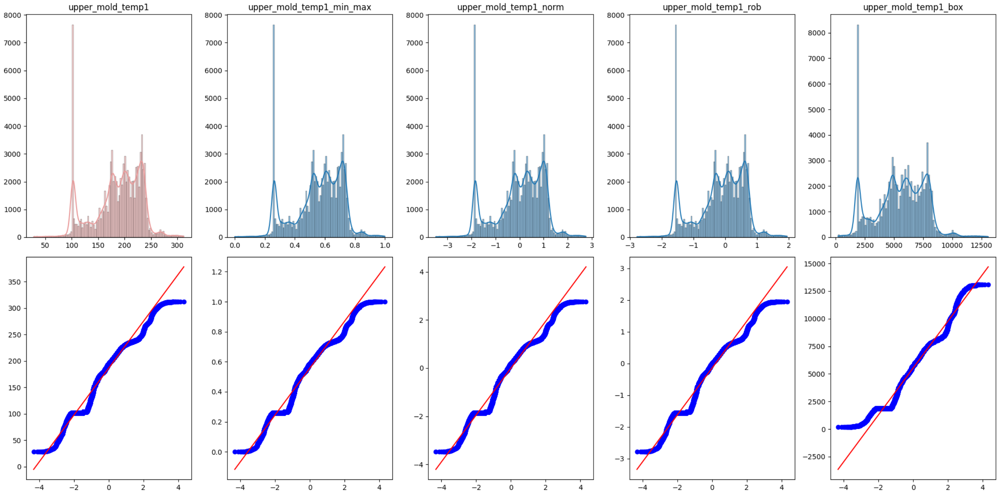
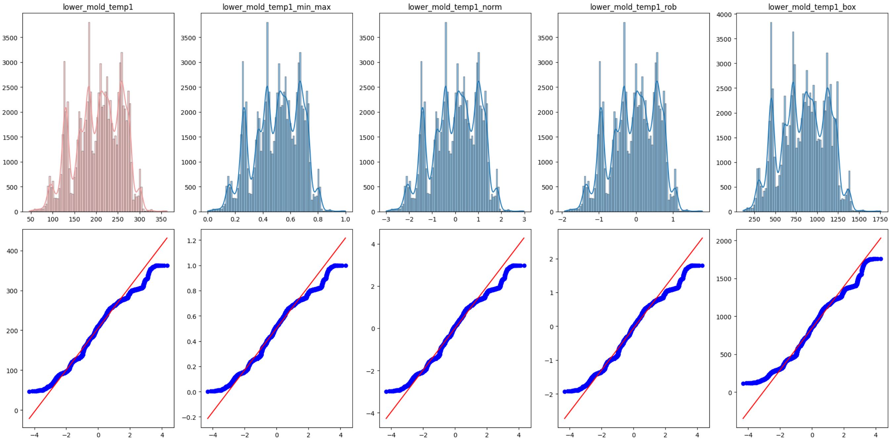
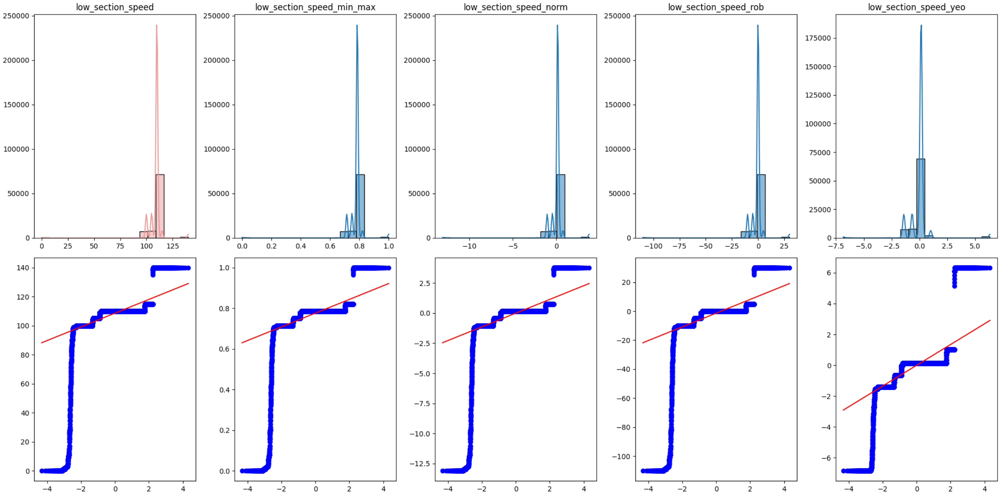
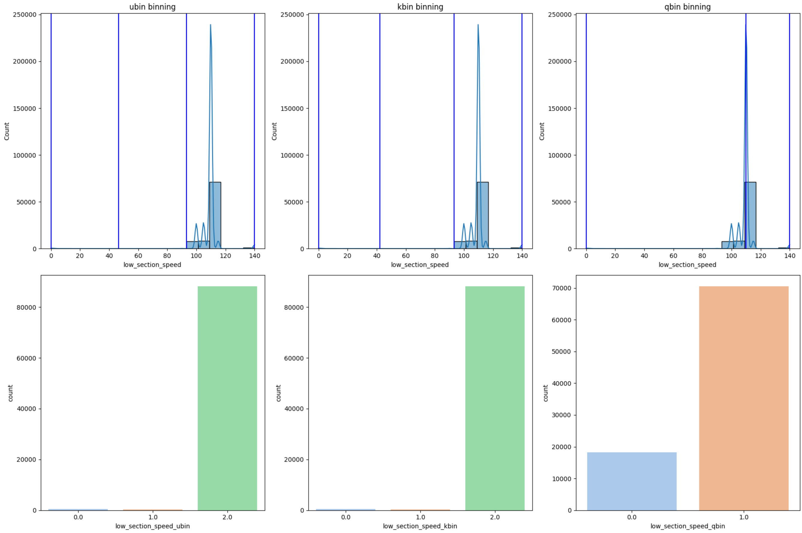
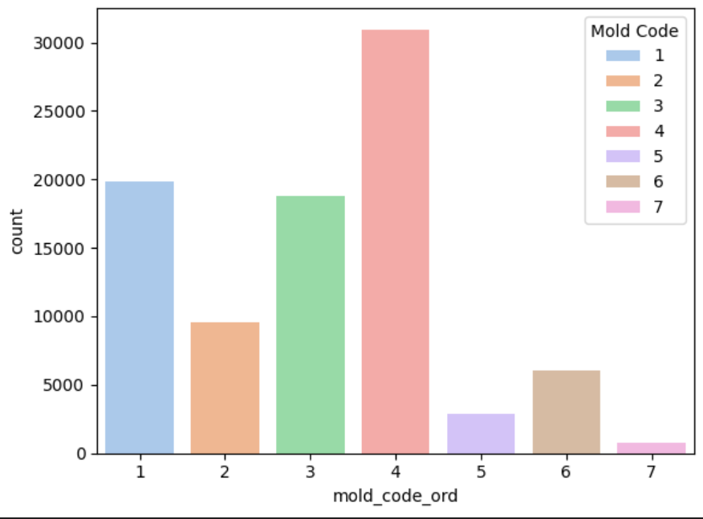

# **✨ DAEM Team Project**
## **┗ EDA about Casting dataset**
---

> **About Data**

* dataset link : https://www.kamp-ai.kr/aidataDetail?AI_SEARCH=%EC%A3%BC%EC%A1%B0&page=1&DATASET_SEQ=53&EQUIP_SEL=&GUBUN_SEL=&FILE_TYPE_SEL=&WDATE_SEL=
* Dataset Description
    * **Casting** is a manufacturing process where metals (such as iron, aluminum alloys, copper, etc.) are melted and poured into molds to solidify, making it suitable for creating detailed and complex shapes and ideal for mass production.
    * Types of casting include die casting (metal molds), sand casting (sand molds), and shell casting (cell molds).
    * **Die casting** is a process where molten metal is forcibly injected into a metal mold (die), primarily using aluminum alloys, copper alloys, and magnesium alloys. The advantages of die casting include high precision, low cost, and fast production speed.
    * Key factors in die casting include the management of `pressure`, `speed`, `time`, and `temperature.`

* 📍The primary analysis goal is to classify pass or fail outcomes by analyzing various key factors.

> **Variable Description**

|Column|Description|
|:---|:---|
|line|Name of the production line where the product is manufactured|
|name|The name of the product|
|mold_name|The name of the mold used to produce the product|
|time|The date when the data was collected (hours, minutes, seconds)|
|date|The time when the data was collected|
|count|The unique number of the product produced on that specific date,representing the production sequence for each day|
|working|Indicates whether the facility is operational ('Operating' or 'Stopped')|
|emergency_stop|Indicates whether the facility is in an emergency stop state ('ON' or 'OFF')|
|molten_temp|The temperature of the molten metal (molten temperature)|
|facility_operation_CycleTime|The operation cycle time of the facility, indicating how long one cycle of operation took|
|production_CycleTime|The cycle time required to produce one product|
|low_section_speed|The speed during the low-speed section, which refers to the speed at which metal is injected during the low-speed phase of die casting|
|high_section_speed|The speed during the high-speed section, referring to the speed of metal injection during the high-speed phase of die casting|
| molten_volume|The volume of molten metal used for casting|
|cast_pressure|The pressure applied when injecting metal into the mold during casting.
|biscuit_thickness|The thickness of the biscuit, the leftover portion between the product and the mold after casting.
|upper_mold_temp1|The temperature at the first point of the upper mold.
|upper_mold_temp2|The temperature at the second point of the upper mold.
|upper_mold_temp3|The temperature at the third point of the upper mold.
|lower_mold_temp1|The temperature at the first point of the lower mold.
|lower_mold_temp2|The temperature at the second point of the lower mold.
|lower_mold_temp3|The temperature at the third point of the lower mold.
|sleeve_temperature|The temperature of the sleeve (a specific part of the mold).
|physical_strength|The physical strength of the product (or measured force).
|Coolant_temperature|The temperature of the coolant used to rapidly cool the metal after casting.
|EMS_operation_time|The operation time of the electromagnetic stirring equipment.
|registration_time|The time when the data was recorded.
|passorfail|Indicates whether the product passed or failed quality checks (0: Pass, 1: Fail).
|tryshot_signal|The tryshot signal, a signal used under certain conditions during casting.
|mold_code|The code number of the mold used.
|heating_furnace|The name or code of the heating furnace used during production.

---

## 1️⃣ summary statistics

### Missing values

▶️ Variables with more than 30% missing data (`molten_volume`, `tryshot_signal`, `heating_furnace`) are excluded from the analysis.

▶️ Afterward, rows containing missing data will be removed.

---

### Describe
- Describe for numeric variables

- Because there are many variables in casting dataset, we construct `RandomForest` model to find appropriate variabels to anlaysis.

- Select the top 5 features as numerical characteristics
    - cast_pressure
    - lower_mold_temp2
    - upper_mold_temp1
    - lower_mold_temp1
    - low_section_speed

---

## 2️⃣ Data Transformation

- Min-max
- Normalization
- Robust Scaling
- box-cox transformation

### Handling Outliers

Before performing transformation we have to handle the outliers.

### Transformation for numerical variables

#### Min Max Transformation

#### Normalization

#### Robust Transformation

#### Box-Cox Transformation

### Ordinal Encoder for categorical variables
*이탤릭체 텍스트*

## 3️⃣ Data Visualization

### Histogram and Q-Q Plot

- Since the `Cast pressure` has a distribution skewed to the right, box-cox transformation seems appropriate.
- After box-cox transform, a more even distribution.
- It is closest to a normal distribution in the Q-Q Plot.

- `lower_mold_temp2` has a multi-distribution with many peaks
- There are no specific outliers
- The shape of the distribution does not change no matter which transformation method is used
- Therefore, simply select **Standardization**

- `upper_mold_temp1` exhibits a multi-modal distribution with several peaks.  
- Based on the QQ plot, it appears to approximate a normal distribution to some extent.  
- After applying MinMax scaling, Normalization, and Robust scaling, no significant changes in the distribution were observed.  
- The Box-Cox transformation seems to merely shift the original distribution to the left.  
- No significant outliers were detected.  
- Therefore, **Standardization** is chosen as the preferred method.

- `lower_mold_temp_1` exhibits a distribution with multiple peaks.  
- Similar to other cases, applying transformations to `lower_mold_temp_1` did not result in any significant changes to the distribution.  
- Although the Box-Cox transformation shows a different distribution and QQ plot compared to other transformations, it cannot be considered significantly better.  
- Therefore, **Standardization** is simply selected.

- After applying transformations, `low_section_speed` remains almost identical to its original distribution.  
- Yeo-Johnson transformation was used instead of Box-Cox because the data contains values of 0. While the Yeo-Johnson result appears relatively closer to a normal distribution compared to other transformations, it cannot be considered significantly improved.

### Binning low_section_speed

- With histogram, it seems that binning would be more appropriate to `low_section_speed`

- **ubin and kbin**:  
  - Both binning methods result in an extreme concentration of data in a single bin, making them potentially unsuitable for data analysis and modeling.  
  - Particularly, ubin divides the data into equal intervals without considering the distribution, leading to excessive data concentration in certain intervals.  

- **qbin**:  
  - Since qbin sets bins based on the number of data points, it achieves a relatively balanced distribution.  
  - This method is likely more effective in avoiding bias towards specific intervals during data analysis and modeling.  

- **Overall Evaluation**:  
  - The data is heavily concentrated around specific values (e.g., 100–120), resulting in a skewed distribution.  
  - To address the issue of data imbalance, **qbin (Quantile Binning)** appears to be the most suitable method.  
  - In contrast, ubin and kbin fail to mitigate the skewed distribution, requiring caution when used in analysis and modeling.

### Label chart

- The `mold_code_ord` variable consists of **7 categories** (1, 2, 3, 4, 5, 6, 7) as categorical data.
- The distribution of the data can be summarized as follows:
  - **Mold Code 4**: This category has the highest count, with over **30,000 instances**.  
  - **Mold Code 1 and 3**: These are the second most frequent categories, each with more than **20,000 instances**.  
  - **Mold Code 2**: This category has a relatively lower count of approximately **10,000 instances**.  
  - **Mold Code 5, 6, and 7**: These categories have the lowest counts, with **Mold Code 7** being the least frequent.
